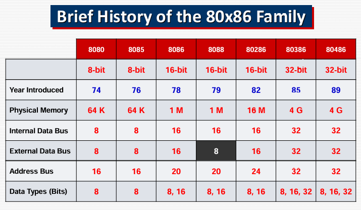

# CPU

or Central processing unit is the brain of computer . Main function of CPU is exchange processes from memory and execute it

# RAM

or Random access memory , also called volatile memory or main memory . Containing temporary data for read and write.

# I/O

I/O main function is to communicate with CPU.

# Bus

is wired group to communicate within computer system components.

### CPUs evolution

Brief history of 80x86 CPUs family :

